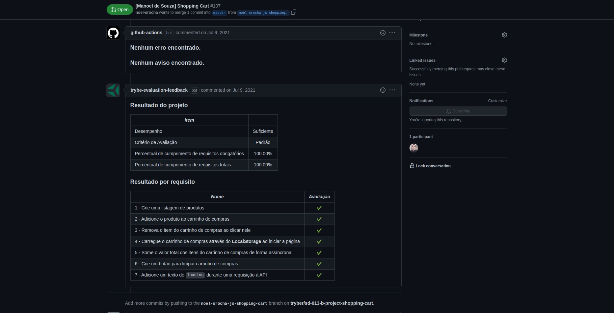

# Project Shopping Cart

Hello and welcome to the Shopping Cart project!

This was an assignment made by [Trybe](https://www.betrybe.com) in order to test my skills with HTML, CSS and JavaScript, this time consuming [Mercado Livre](https://www.mercadolivre.com)'s API through the endpoint below:

```javascript
"https://api.mercadolibre.com/sites/MLB/search?q=$QUERY"
```

### The Assignment

*In this project you will make a fully dynamic shopping cart! And the best: consuming data directly from an API! That's right. From the acronym in English Application Programming Interface, an API is a point of contact on the internet with a certain service. Through HTTP requests to this API, it is possible to interact with it in the way that whoever created it planned. Here we will use the Mercado Livre API to search for products for sale.*

### Skills to be Tested

In this project, I was able to:

- Make requests to an API (Application Programming Interface) from Mercado Libre;
- Use my knowledge of JavaScript, CSS and HTML;
- Work with asynchronous functions.

### Evaluator Results


